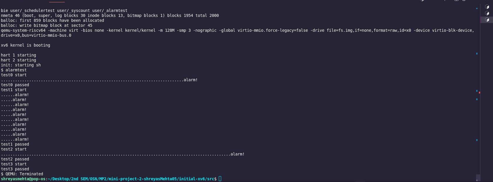

<!-- add an emoji to the title to make it more appealing -->
# XV6 Operating System `💻 💾`


## Author: <i> Shreyas Mehta </i> `👨‍💻`

## Description `📄`
- `XV6` is a simple Unix-like teaching operating system developed in the summer of 2006 for MIT's operating systems course, 6.828: Operating System Engineering. It is a re-implementation of Dennis Ritchie's and Ken Thompson's Unix Version 6 (v6). 
- The main purpose of the project is to understand the internal working of an operating system. In this project, I have worked on the `XV6` operating system to implement various system calls and scheduling algorithms.
- This was a part of the course `Operating Systems and Networks` at IIIT Hyderabad.
- The project was divided into two parts:
  - Implementing various system calls
  - Implementing various scheduling algorithms
- The system calls implemented were `getSysCount`, `sigalarm`, and `sigreturn`
- The scheduling algorithms implemented were `lottery scheduling` and `multi-level feedback queue (MLFQ)`
- The project was implemented in the `C` programming language.
---

## Index  `📚`
- [Introduction](#introduction)
- [System Calls](#system-calls-20-points)
  - [Gotta count ‘em all](#gotta-count-em-all-7-points)
  - [Wake me up when my timer ends](#wake-me-up-when-my-timer-ends-13-points)
- [Scheduling](#scheduling-40-points)
  - [The process powerball](#the-process-powerball-15-points)
  - [MLF who? MLFQ!](#mlf-who-mlfq-25-points)
---

## INTRODUCTION `📖`
- In this project, I have worked on the `XV6` operating system to implement various system calls and scheduling algorithms.

## SYSTEM CALLS [20 Points] `📞`
### <i><u> Gotta count ‘em all [7 points] </u></i> `🔢`
- Implemented the system call `getSysCount`
    - `syntax: syscount <mask> command [args]`
    - `mask` is a 32-bit integer that specifies which system calls to count
    - `command` is the command to execute
    - `args` are the arguments to the command
    - The system call returns the number of times the system calls specified by the mask have been called in executing the command
    - If the mask is invalid, the system call returns -1
    ---
#### Adding the system call `getSysCount`
- First in the `kernel/syscall.h` file, I defined the system call number for `getSysCount` as `23`
- Then in the `kernel/syscall.c` file, I added the prototype for the system call which is `extern uint64 sys_getSysCount(void);` and also added this to the `syscalls` array
- Then in the `kernel/sysproc.c` file, I added the implementation for the system call
    - I first increment the system call count for the system call number 23
    - then i extract the mask from the arguments and pass it to the `getSysCount` function
    - return the value returned by the `getSysCount` function
    - ```c
      uint64 
      sys_getSysCount(void){
        myproc()->syscallCount[SYS_getSysCount]++;
        int mask; // this is the mask for the system call
        argint(0, &mask); // extract the mask from the arguments
        return getSysCount(mask);
      }
      ```
      ---
- The `getsyscount` function is implemented in the `kernel/proc.c` file
    - ```c
      int getSysCount(int mask){
        int getsysCallId = -1;
        // Find the system call id from the bitmask
        for(int i = 0; i < 32; i++){
          if((mask & (1 << i)) != 0){
            getsysCallId = i;
            break;
          }
        }
        // If no valid system call id was found, return -1
        if(getsysCallId == -1){
          return -1;
        }
        // Get the system call count for the process
        int countSysCall = myproc()->syscallCount[getsysCallId];  // assuming syscallCount is tracked in the proc structure
        return countSysCall;
      }
      ```   
      ---
- Defined the sytem call in the `user/user.pl` file
    - ```perl
      entry("getSysCount");
      ```
      ---
- Added the function prototype in the `suer/user.h` file 
    - ```c
      int getSysCount(int mask);
      ```
      ---
- Added the function declaration in the `kernel/defs.h` file
    - ```c
      int             getSysCount(int);
      ```
      ---
#### Logic `🧠`
- First we added an array to the `proc` structure in `kernel/proc.h`  to keep track of the number of times each system call is called
  - ```c
    struct proc {
      ...
      int syscallCount[32]; // to keep track of the number of times each system call is called
      ...
    };
    ```
- Then in each `sys_...` function in the `kernel/sysproc.c` file, we increment the count of the corresponding system call in the `syscallCount` array
- We initialize the `syscallCount` array to all zeros in the `kernel/proc.c` file in the `initproc` function and in `static void
freeproc(struct proc *p)` function
  - ```c
    void
    initproc(void)
    {
      ...
      for(int i=0;i<32;i++){
      p->syscallCount[i]=0;
      }
      ...
    }
    ...
    static void
    freeproc(struct proc *p)
    {
      ...
      for(int i=0;i<32;i++){
      p->syscallCount[i]=0;
      }
      ...
    }
    ```
- To add the syscount of the child process to the parent process, we added this count in the exit function in the `kernel/proc.c` file
  - ```c
    void
    exit(int status)
    {
      ...
      // add child syscounts to parent
      for(int i=0;i<32;i++){
        p->parent->syscallCount[i] += p->syscallCount[i];
      }
      ...
    }
    ```
- Now we can use this system call in the user space to get the count of the system calls by making a program `syscount.c` in the `user` directory
  Here’s the markup for your explanation of how the `syscount` program works:

---

## How the `syscount` Program Works: `🔍`

1. **Step 1: Input validation**
    - The program first checks if the user has provided enough arguments (`<mask>` and `command [args]`). If not, it prints a usage message and exits.
    - The `mask` (provided as a string) is checked to ensure it contains only numeric characters (`0–9`). If the mask is invalid, the program prints an error and exits.

2. **Step 2: Converting the mask to an integer**
    - The `mask` is converted from a string (`argv[1]`) to an integer using `atoi(argv[1])`. This `mask` is a bitmask where each bit represents a system call.
    - A `fork` is then called to create a child process to run the command, and both the parent and child processes will later be monitored for system call counts.

3. **Step 3: Calling the `getSysCount` system call in the parent process**
    - The parent process calls `getSysCount(mask)` to retrieve the current system call count for the specified system calls before the child process executes.

4. **Step 4: Executing the command in the child process**
    - The child process, after the `fork`, runs `exec(argv[2], argv + 2)` to execute the specified command (with any optional arguments).
    - If the `exec` fails, the child process prints an error message and exits.

5. **Step 5: Waiting for the child process to complete**
    - The parent process waits for the child to finish using `wait(0)`.

6. **Step 6: Calling `getSysCount` in the parent process after command execution**
    - After the child completes, the parent calls `getSysCount(mask)` again to obtain the system call count for the specified mask.
    - If either the initial or final call to `getSysCount` fails (returns `-1`), an error message is printed.

7. **Step 7: Outputting the system call count**
    - The program checks the bit positions in the `mask` to determine which system call was monitored. It uses this bit position to map the system call ID to a name from the `syscall_names` array.
    - It prints the difference between the system call counts before and after executing the command (i.e., how many times the specified system call was invoked).

---


### <i> <u> Wake me up when my timer ends [13 points] </u> </i> `⏰`
- <b> Adding system calls </b>
  - `sigalarm` system call
    - `syntax: sigalarm <ticks> <handler>`
    - `ticks` is the number of ticks after which the alarm signal is sent to the process
    - The system call returns 0 on success and -1 on failure
    ---
  - `sigreturn` system call
    - `syntax: sigreturn`
    - The system call returns 0 on success and -1 on failure
    ---
  - Made changes in the `kernel/syscall.h` file to define the system call numbers for `sigalarm` and `sigreturn`
    - ```c
      #define SYS_sigalarm 24
      #define SYS_sigreturn 25
      ```
    ---
  - Added the prototypes for the system calls in the `kernel/syscall.c` file
    - ```c
      extern uint64 sys_sigalarm(void);
      extern uint64 sys_sigreturn(void);
      ```
    ---
  - Added their entries in the `syscalls` array in the `kernel/syscall.c` file
    - ```c
      [SYS_sigalarm] sys_sigalarm,
      [SYS_sigreturn] sys_sigreturn,
      ```
    ---
  - Added them in the user space in the `user/user.pl` file
    - ```perl
      entry("sigalarm");
      entry("sigreturn");
      ```
    ---
  - Added the function prototypes in the `user/user.h` file
    - ```c
      int sigalarm(uint64, void (*handler)());
      int sigreturn(void);
      ```
    ---
  - Added the function declarations in the `kernel/defs.h` file
    - ```c
      int             sigalarm(uint64, void (*handler)());
      int             sigreturn(void);
      ```
    ---
  - Added the implementation for the `sigalarm` system call in the `kernel/sysproc.c` file
    - ```c
      uint64
      sys_sigalarm(void)
      {
        myproc()->syscallCount[SYS_sigalarm]++;
        uint64 ticks;
        uint64 handler;
        argaddr(0, &ticks);
        argaddr(1, &handler);
        if(ticks < 0){
          return -1;
        }
        return sigalarm(ticks, (void (*)())handler);
      }
      ```
    ---
  - Added the implementation for the `sigreturn` system call in the `kernel/sysproc.c` file
    - ```c
      uint64
      sys_sigreturn(void)
      {
        myproc()->syscallCount[SYS_sigreturn]++;
        return sigreturn();
      }
      ```
    ---
  - Defined the `sigalarm` and `sigreturn` functions in the `kernel/proc.c` file
    - ```c
      int sigalarm(uint64 ticks, void (*handler)()) {
          struct proc *process = myproc();  // Get the current process
          process->sigretaddr = (uint64)handler;  // Store the handler address to invoke when the alarm triggers
          process->alarmticks = ticks;  // Set the number of ticks for the alarm
          return 0;  // Return 0 to indicate success
      }

      int sigreturn(void) {
          struct proc *process = myproc();  // Get the current process
          if (process->trapframebackup == 0) {  // Check if the trapframe backup exists
              return -1;  // If not, return -1 to indicate failure
          }
          process->alarmticks = process->passedticks;  // Reset the alarm ticks to previously passed ticks
          process->passedticks = 0;  // Reset the passed ticks
          memmove(process->trapframe, process->trapframebackup, sizeof(*process->trapframe));  // Restore the saved trapframe
          return process->trapframebackup->a0;  // Return the value in the restored trapframe
      }
      ```
    ---
  - initialized the `alarmticks`, `passedticks`, and `trapframebackup` variables in the `allocproc` function in the `kernel/proc.c` file
    - ```c
      // Sigalarm and sigreturn
      p->alarmticks = 0; // initialize alarmticks
      p->sigretaddr = 0; // initialize sigretaddr
      p->passedticks = 0; // initialize passedticks
      p->trapframebackup = 0; // initialize trapframebackup
      ```
    ---
  - Added the necessary variables to the `proc` structure in the `kernel/proc.h` file
    - ```c
      struct proc {
        ...
        uint64 sigretaddr;  // Address of the signal handler
        uint64 alarmticks;  // Number of ticks for the alarm after which the signal is sent
        uint64 passedticks;  // Number of ticks passed
        struct trapframe *trapframebackup;  // Backup of the current trapframe
        ...
      };
      ```
    ---
  - Added the logic to handle the alarm signal in the `kernel/trap.c` file
    - ```c
      //////////////////////////////////////////////////////////////////////
      //////////////////////////////////////////////////////////////////////
      // check if the alarm has run out
      int checkAlarm(struct proc *process){
        if(process->alarmticks < process->passedticks){
          return 1;
        }
        return 0;
      }
      //////////////////////////////////////////////////////////////////////
      // if alarm has run out, then set the epc to the handler
      void setEPC(struct proc *process){
        process->trapframe->epc = process->sigretaddr; // set the epc to the handler
      }
      //////////////////////////////////////////////////////////////////////
      // reset the alarm
      void resetAlarm(struct proc *process){
        process->passedticks = process->alarmticks; // reset the passed ticks
        process->alarmticks = 0; // disable the alarm
      }
      //////////////////////////////////////////////////////////////////////
      // back up the trapframe
      void backUpTrapFrame(struct proc *process){
        process->trapframebackup = (struct trapframe *) kalloc(); // allocate memory for the backup trapframe
        memmove(process->trapframebackup, process->trapframe, sizeof(struct trapframe)); // copy the current trapframe to the backup trapframe
      }
      //////////////////////////////////////////////////////////////////////
      void logicForTicking(struct proc *process){
        if(process->alarmticks>0){
          if(checkAlarm(process)){
            resetAlarm(process); // step 1

            backUpTrapFrame(process); // step 2

            setEPC(process); // step 3
          }
          else{
            process->passedticks++;
          }
          return;
        }
      }
      //////////////////////////////////////////////////////////////////////
      ////////////////////////////////////////////////////////////////////
      ```
    ---
#### Logic `🧠`
- We added the necessary variables to the `proc` structure in the `kernel/proc.h` file to store the `signal handler address, alarm ticks, passed ticks, and a backup of the trapframe`.
- The `sigalarm` system call is implemented in the `kernel/sysproc.c` file. It extracts the `ticks` and `handler` from the arguments and calls the `sigalarm` function with these values.
- The `sigreturn` system call is implemented in the `kernel/sysproc.c` file. It calls the `sigreturn` function to reset the alarm ticks and restore the trapframe.
- The `sigalarm` and `sigreturn` functions are defined in the `kernel/proc.c` file. The `sigalarm` function sets the alarm ticks and signal handler address, while the `sigreturn` function resets the alarm ticks and restores the trapframe.
- We added the logic to handle the alarm signal in the `kernel/trap.c` file. The `checkAlarm` function checks if the alarm has run out, the `setEPC` function sets the `epc` to the handler address, the `resetAlarm` function resets the alarm, the `backUpTrapFrame` function backs up the trapframe, and the `logicForTicking` function handles the ticking logic.
#### Testing `🧪`
- To test the `sigalarm` and `sigreturn` system calls, we use `alarm.c` in the `user` directory.
- Results
  - ```shell
    $ alarmtest
    test0 start
    ..............................................................................alarm!
    test0 passed
    test1 start
    ......alarm!
    .....alarm!
    ......alarm!
    .....alarm!
    .....alarm!
    ......alarm!
    .....alarm!
    .....alarm!
    .....alarm!
    ......alarm!
    test1 passed
    test2 start
    ..................................................................................................alarm!
    test2 passed
    test3 start
    test3 passed
    ```
    ---
  - Image: 

## SCHEDULING [40 points] `📊`
### <i> <u> The process powerball [15 points] </u> </i> `🎟️`
- Implemented the `lottery scheduling` algorithm in the `kernel/proc.c` file
  - First, we added the necessary variables to the `proc` structure in the `kernel/proc.h` file to store the `lottery ticket count`.
    - ```c
      struct proc {
        ...
        // For scheduler LBS
        int numTickets; // number of tickets for the process
        int timeOfArrival; // time of arrival of the process
        uint64 timeSlice; // time slice for the process
        ...
      };
      ```
    ---
  - And initialise them in the `allocproc` function in the `kernel/proc.c` file
    - ```c
      void
      allocproc(void)
      {
        ...
        // For scheduler LBS
        if(p->parent == 0){
          p->numTickets = 1 ; // default number of tickets
        }
        else{
          p->numTickets = p->parent->numTickets; // inherit the number of tickets from the parent
        }
        #ifdef LBS
        // p->numTickets = pseudoRandom(r_time(0),1000);
        // printf("Process %s initialized with %d tickets\n", p->name, p->numTickets);
        #endif
        p->timeOfArrival = ticks; // time of arrival of the process
        p->timeSlice = 1; // default time slice for the process is 1 tick
        ...
      }
      ```
    ---
  - Now we added the logic to assign tickets to the processes in the `kernel/proc.c` file
    - ```c
      //////////////////////////////////////////////////////////////////////////////////////////
      //////////////////////////////////////////////////////////////////////////////////////////
      // pseudo random number generator to get the probability of the process given by gpt
      uint64 pseudoRandom(uint64 seed,int max){
        uint64 multiplier = 1664525;
        uint64 increment = 1013904223;
        uint64 modulus = 4294967296;
        seed = (seed * multiplier + increment) % modulus;
        if(seed < 0){
          seed = seed * -1;
        }
        if(max == 0){
          return 0;
        }
        seed = seed % max;
        return seed;
      }
      //////////////////////////////////////////////////////////////////////////////////////////
      //////////////////////////////////////////////////////////////////////////////////////////
      // condition to find the process to run based on the lottery scheduling
      int atomicLBSFind(int random,int total,struct proc* p){
        if(random <= total+p->numTickets){ // total < random <= total+p->numTickets
          return 1;
        }
        return 0;
      }
      // find the process to run based on the lottery scheduling
      struct proc *processToRunLBS(uint64 totalTickets, uint64 randomNumber){
        // now we will iterate over the processes and find the process to run
        struct proc* processToRun = 0; // process to run
        uint64 total = 0; // variable to keep track of the total number of tickets before the current process
        for (struct proc *p = proc; p < &proc[NPROC]; p++) // iterate over the process list
        {
          acquire(&p->lock);
          if (p->state == RUNNABLE)
          { 
            
            if(atomicLBSFind(randomNumber,total,p)){
              processToRun = p;
              release(&p->lock);
              break;
            }
            total += p->numTickets;
          }
          release(&p->lock);
        }
        return processToRun;
      }
      //////////////////////////////////////////////////////////////////////////////////////////
      //////////////////////////////////////////////////////////////////////////////////////////
      int atomicCheckArrival(uint64 minArrivalTime,struct proc* p){
        if(p->timeOfArrival < minArrivalTime){
          return 1;
        }
        return 0;
      }
      // find the 2nd tier process to run based on the lottery scheduling
      struct proc *checkArrival(uint64 minArrivalTime, struct proc* processToRun){
        for (struct proc *p = proc; p < &proc[NPROC]; p++)
        {
          acquire(&p->lock);
          if (p->state == RUNNABLE)
          {
            // check if the process has the same number of tickets and has less arrival time
            if(p->numTickets == processToRun->numTickets && atomicCheckArrival(minArrivalTime,p)){
              minArrivalTime = p->timeOfArrival;
              processToRun = p;
            }
          }
          release(&p->lock);
        }
        return processToRun;
      }
      //////////////////////////////////////////////////////////////////////////////////////////
      //////////////////////////////////////////////////////////////////////////////////////////
      // find the process to run based on the lottery scheduling
      struct proc *lotteryScheduling(){
        uint64 totalTickets = getTotalTickets();
        // printf("Total Tickets: %d\n",totalTickets);
        if(totalTickets == 0){
          return 0; // no process to run
        }
        uint64 randomNumber = pseudoRandom(r_time(0),totalTickets)+1; // get the random number
        // now we will iterate over the processes and find the process to run
        struct proc* processToRun = processToRunLBS(totalTickets,randomNumber);
      //////////////////////////////////////////////////////////////////////////////////////////
        // 2nd pass to find the process with least arrival time
        if(processToRun == 0){
          return 0; // no process to run
        }
        uint64 minArrivalTime = processToRun->timeOfArrival;
        processToRun = checkArrival(minArrivalTime,processToRun);
        return processToRun;
      }
      //////////////////////////////////////////////////////////////////////////////////////////
      //////////////////////////////////////////////////////////////////////////////////////////
      //////////////////////////////////////////////////////////////////////////////////////////
      //////////////////////////////////////////////////////////////////////////////////////////
      ```
    ---
  - Added the logic to handle the lottery scheduling in the `void scheduler(void)` function in the `kernel/proc.c` file
    - ```c
      //////////////////////////////////////////////////////////////////////////////////////////
      //////////////////////////////////////////////////////////////////////////////////////////
      #ifdef LBS
        // lottery based scheduling
        p = lotteryScheduling();
        if(p == 0){
          continue;
        }
        acquire(&p->lock);
        if(p->state != RUNNABLE){
          release(&p->lock);
          continue;
        }
        p->state = RUNNING;
        c->proc = p;
        p->timeSlice = 1; // reset the time slice
        swtch(&c->context, &p->context);
        c->proc = 0;
        release(&p->lock);
      #endif
      //////////////////////////////////////////////////////////////////////////////////////////
      //////////////////////////////////////////////////////////////////////////////////////////
      ```
  - Now in file `trap.c` we added the logic to handle the time slice for the processes
    ```c
    #ifdef LBS
    if(p!=0 && p->state == RUNNING){
      p->timeSlice--; // decrement the time slice
      if(p->timeSlice <= 0){ // if the time slice is over
        p->timeSlice = 1; // reset the time slice
        yield(); // yield the process
      }
    }
    #endif
    ```
    ---
#### Logic `🧠`
- We added the necessary variables to the `proc` structure in the `kernel/proc.h` file to store the `lottery ticket count`.
- We added the logic to assign tickets to the processes in the `kernel/proc.c` file. The `pseudoRandom` function generates a pseudo-random number, the `atomicLBSFind` function checks if the process should be run based on the lottery scheduling, the `processToRunLBS` function finds the process to run based on the lottery scheduling, the `atomicCheckArrival` function checks if the process has a lower arrival time, and the `checkArrival` function finds the process with the least arrival time.
- We added the logic to handle the lottery scheduling in the `void scheduler(void)` function in the `kernel/proc.c` file. The `lotteryScheduling` function finds the process to run based on the lottery scheduling, and the process is then scheduled to run.
- We added the logic to handle the time slice for the processes in the `trap.c` file. The time slice is decremented for the running process, and if the time slice is over, the process is yielded.
### NOTE
- Added the system call `settickets` for checking purposes.
#### Testing
- All the results are in the [report](report.md)


### <i> <u> MLF who? MLFQ! [25 points] </u> </i> `🔄`
- Implemented the `multi-level feedback queue (MLFQ)` scheduling algorithm in the `kernel/proc.c` file
  - First, we added the necessary variables to the `proc` structure in the `kernel/proc.h` file to store the `priority level, time slice, entry time, and execution time`.
    - ```c
      struct proc {
        ...
        int priorityLevel; // Priority level of the process
        int slice;  // Time slice allocated in ticks
        int entryTime; // Queue entry time for MLFQ scheduling
        int execTime;  // Execution time of the process after the last queue entry
        ...
      };
      ```
    ---
  - And initialise them in the `allocproc` function in the `kernel/proc.c` file
    - ```c
      void
      allocproc(void)
      {
        ...
        p->priorityLevel=0;
        p->slice=_RESET_SLICE_MLFQ_; // 1
        p->entryTime=ticks;
        p->execTime=0;
        ...
      }
      ```
    ---
  - We also defined some MACROS and GLOBAL vaariables in `kernel/param.h` file for the MLFQ scheduling
    - ```c
      #define _MAXLEVEL_MLFQ_     4    // Maximum Level in MLFQ
      #define _MAXPROCESS_MLFQ_   64   // Maximum Processes in MLFQ
      #define _PRIORITY_BOOST_MLFQ_ 48 // Priority Boost in MLFQ
      #define _MAXXXXXX_ 1000000000 // Maximum value for a variable -1e9
      #define _RESET_SLICE_MLFQ_ 1// Reset the time slice in MLFQ

      extern int mlfqSlice[_MAXLEVEL_MLFQ_];
      ```

  - Now we added the logic to handle the MLFQ scheduling in the `void scheduler(void)` function along with some helper functions in the `kernel/proc.c` file
    - ```c
      //////////////////////////////////////////////////////////////////////////////////////////
      //////////////////////////////////////////////////////////////////////////////////////////
      // found the process to run based on the MLFQ scheduling
      void foundProcessToRun(int __FOUND_PROCESS_TO_RUN__,struct proc *processToRun, struct cpu *c){
        if(!__FOUND_PROCESS_TO_RUN__) 
        {
          return;
        }
        
        processToRun->state = RUNNING; // change the state to running
        c->proc = processToRun; // set the process to run
        swtch(&c->context, &processToRun->context); // switch the context

        
        c->proc = 0; // reset the process

        release(&processToRun->lock); // release the lock
      }
      //////////////////////////////////////////////////////////////////////////////////////////
      //////////////////////////////////////////////////////////////////////////////////////////
      // atomic check fto find the best process to run based on the MLFQ scheduling
      int atomicCheckProcessToRunMLFQ(struct proc *p,struct proc *processToRun,uint possiblePriority,uint lowestEntryTime){
        if(p->priorityLevel < possiblePriority || (p->priorityLevel == possiblePriority && p->entryTime < lowestEntryTime))  
        {
          return 1;
        }
        return 0;
      }
      //////////////////////////////////////////////////////////////////////////////////////////
      //////////////////////////////////////////////////////////////////////////////////////////

      void scheduler(void)
      {
        ...
        #elif defined MLFQ  
          int __FOUND_PROCESS_TO_RUN__ = 0;
          struct proc *processToRun = 0;
          uint lowestEntryTime = _MAXXXXXX_; // 1e9
          uint possiblePriority = _MAXLEVEL_MLFQ_;

          for(p = proc; p < &proc[NPROC]; p++) 
          {
            acquire(&p->lock);
            if(p->state == RUNNABLE) 
            {
              // Find the highest priority (lowest number) runnable process
              // If multiple processes have the same priority, choose the one that's been waiting the longest
              if(atomicCheckProcessToRunMLFQ(p,processToRun,possiblePriority,lowestEntryTime)) 
              {
                if(processToRun != 0) 
                {
                  // release the previous best process to run
                  release(&processToRun->lock);
                }
                processToRun = p;
                possiblePriority = p->priorityLevel;
                lowestEntryTime = p->entryTime;
                __FOUND_PROCESS_TO_RUN__ = 1;
              } 
              else 
              {
                // release the process as its not the best process to run
                release(&p->lock);
              }
              
            } 
            else 
            {
              // release the process as its not runnable
              release(&p->lock);
            }
          }
          // Run the process if one was found
          foundProcessToRun(__FOUND_PROCESS_TO_RUN__,processToRun,c);
        #else
        ...
      }
      ```

    - Also Initialized the `mlfqSlice` in the `kernel/proc.c` file 
      - ```c
          int mlfqSlice[_MAXLEVEL_MLFQ_] = {1, 4, 8, 16}; // Time slice for each level in MLFQ
        ```
      --- 
    - In trap.c file we added the logic to increment the `__TICKS_BOOST__` variable and to boost the priority of the process
      - ```c
          //////////////////////////////////////////////////////////////////////////////////////////
          //////////////////////////////////////////////////////////////////////////////////////////
          // Increment the ticks for priority boost
          void incrementTicksBoost(){
            if(__TICKS_BOOST__ >= _PRIORITY_BOOST_MLFQ_) 
            {
              __TICKS_BOOST__ = 0; // reset the ticks boost
            } 
            else 
            {
              __TICKS_BOOST__++; // increment the ticks boost
            }
          }
          //////////////////////////////////////////////////////////////////////////////////////////
          //////////////////////////////////////////////////////////////////////////////////////////
          // Priority boost for the MLFQ scheduling
          void priorityBoost(struct proc *p){
            if(__TICKS_BOOST__ < _PRIORITY_BOOST_MLFQ_) // check if the time is less than the priority boost
            {
              return;
            }
            // time to boost the priority
            p->priorityLevel = 0; // boost the priority
            p->slice = _RESET_SLICE_MLFQ_; // reset the time slice
            p->execTime = 0; // reset the execution time
            return;
          }
          //////////////////////////////////////////////////////////////////////////////////////////
          //////////////////////////////////////////////////////////////////////////////////////////
          void usertrap(void)
          {
            ...
            #ifdef MLFQ
            p->execTime++; // increment the execution time
            whenToYield(p); // check when to yield
            /////////////////////////////////////////////////////////
            incrementTicksBoost();
            for(int i=0;i<NPROC;i++){
              if(proc[i].state == RUNNABLE){
                acquire(&proc[i].lock); // acquire the lock
                priorityBoost(&proc[i]); // boost the priority
                release(&proc[i].lock); // release the lock
              }
            }
            #endif
            ...
          }
            //////////////////////////////////////////////////////////////////////////////////////////
            //////////////////////////////////////////////////////////////////////////////////////////
        ```
      ---
    - Also Initialized the `__TICKS_BOOST__` variable in the `kernel/trap.c` file
      - ```c
          int __TICKS_BOOST__ = 0;

        ```
      ---
    - Also in `wakeup` funtion in `kernel/proc.c` we set entry time for the process this ensures that the `I/O bound` processes get a chance to run and are enqueued in the MLFQ in the end thus we set its value to the current ticks
      - ```c
          void wakeup(void *chan)
          {
            struct proc *p;

            for (p = proc; p < &proc[NPROC]; p++)
            {
              if (p != myproc())
              {
                acquire(&p->lock);
                if (p->state == SLEEPING && p->chan == chan)
                {
                  p->state = RUNNABLE;
                  p->entryTime = ticks; // set the entry time to the current ticks
                }
                release(&p->lock);
              }
            }
          }
        ```
      ---
#### Logic `🧠`
- We added the necessary variables to the `proc` structure in the `kernel/proc.h` file to store the `priority level, time slice, entry time, and execution time`.
- We added the `__TICKS_BOOST__` variable in the `trap.c` file to keep track of the ticks for priority boost.
- We added the logic to handle the MLFQ scheduling in the `void scheduler(void)` function in the `kernel/proc.c` file. The `atomicCheckProcessToRunMLFQ` function checks if the process should be run based on the MLFQ scheduling, and the `foundProcessToRun` function runs the process if one is found.
- We also initialized the `mlfqSlice` in the `kernel/proc.c` file and added the logic to increment the `__TICKS_BOOST__` variable and to boost the priority of the process in the `trap.c` file.
- We also set the entry time for the process in the `wakeup` function in the `kernel/proc.c` file to ensure that I/O-bound processes get a chance to run and are enqueued in the MLFQ.

#### Testing `🧪`
- All the results are in [report](report.md)


### References `🔗`
- [XV6](https://pdos.csail.mit.edu/6.828/2012/xv6.html)
- [XV6 Book](https://pdos.csail.mit.edu/6.828/2012/xv6/book-rev7.pdf)
- [Online](https://xiayingp.gitbook.io/build_a_os/labs/lab-6-alarm#add-2-system-calls)