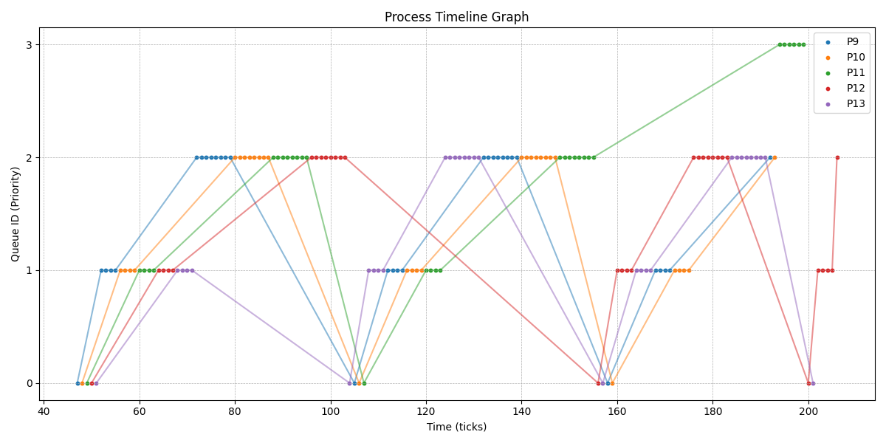
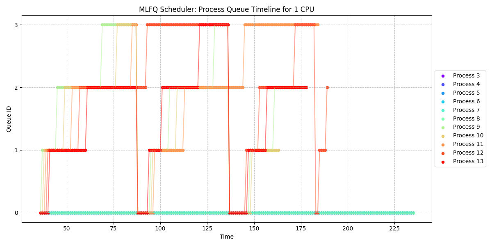

# Scheduling Report

## Round Robin (RR)

### Logic:
- By default, the scheduler is set to `Round Robin (RR)`.

### Results:
```shell
[Process 10 with wtime 120, rtime 30 finished]
[Process 9 with wtime 121, rtime 30 finished]
[Process 8 with wtime 121, rtime 30 finished]
[Process 7 with wtime 121, rtime 30 finished]
[Process 6 with wtime 120, rtime 32 finished]
[Process 5 with wtime 200, rtime 0 finished]
[Process 4 with wtime 200, rtime 0 finished]
[Process 3 with wtime 200, rtime 0 finished]
[Process 2 with wtime 200, rtime 0 finished]
[Process 1 with wtime 200, rtime 0 finished]
Average rtime 15, wtime 160
```

### Observation:
- The average `runtime` is `15` and the average `wait time` is `160`.

### Conclusion:
- This is accurate. In `RR`, each process is given a `fixed time slice`, ensuring equal distribution of CPU time. This results in `consistent runtime` across processes and a `balanced wait time`.

---

## Lottery-Based Scheduling (LBS)
### Logic:
- We added the necessary variables to the `proc` structure in the `kernel/proc.h` file to store the `lottery ticket count` `arrival time` and `time slice`.
- We added the logic to assign tickets to the processes in the `kernel/proc.c` file. The `pseudoRandom` function generates a pseudo-random number, the `atomicLBSFind` function checks if the process should be run based on the lottery scheduling, the `processToRunLBS` function finds the process to run based on the lottery scheduling, the `atomicCheckArrival` function checks if the process has a lower arrival time, and the `checkArrival` function finds the process with the least arrival time.
- We added the logic to handle the lottery scheduling in the `void scheduler(void)` function in the `kernel/proc.c` file. The `lotteryScheduling` function finds the process to run based on the lottery scheduling, and the process is then scheduled to run.
- We added the logic to handle the time slice for the processes in the `trap.c` file. The time slice is decremented for the running process, and if the time slice is over, the process is yielded.
### Case:
- When every process is assigned `the same number of tickets`, the behavior mirrors RR.

### Results:
```shell
[Process 10 with wtime 92, rtime 32 finished]
[Process 9 with wtime 109, rtime 32 finished]
[Process 8 with wtime 118, rtime 32 finished]
[Process 7 with wtime 126, rtime 32 finished]
[Process 6 with wtime 128, rtime 32 finished]
[Process 5 with wtime 202, rtime 0 finished]
[Process 4 with wtime 202, rtime 0 finished]
[Process 3 with wtime 204, rtime 0 finished]
[Process 2 with wtime 208, rtime 0 finished]
[Process 1 with wtime 211, rtime 0 finished]
Average rtime 16, wtime 160
```

### Observation:
- When all processes are given an `equal number of tickets`, `LBS behaves like RR`.

### Conclusion:
- This observation is correct. In LBS, if `all processes have equal tickets`, the lottery mechanism behaves like RR, resulting in `even CPU time distribution`.

---
## LBS

### Case: Priority-Based Scheduling with LBS
- If the number of tickets is biased towards `IO-bound processes`, they will have `higher priority`.
#### Code Changes:
```c
if (n < IO) { 
    // This is an IO-bound process
    settickets(10000);
}
```

### Results:
```shell
Setting tickets for process 8 to 10000
Setting tickets for process 5 to 10000
Setting tickets for process 4 to 10000
Setting tickets for process 6 to 10000
Setting tickets for process 7 to 10000
[Process 10 with wtime 110, rtime 31 finished]
[Process 9 with wtime 120, rtime 32 finished]
[Process 8 with wtime 124, rtime 33 finished]
[Process 7 with wtime 124, rtime 32 finished]
[Process 6 with wtime 128, rtime 31 finished]
[Process 5 with wtime 202, rtime 0 finished]
[Process 4 with wtime 202, rtime 0 finished]
[Process 3 with wtime 202, rtime 0 finished]
[Process 2 with wtime 202, rtime 0 finished]
[Process 1 with wtime 202, rtime 0 finished]
Average rtime 15, wtime 161
```

### Observation:
- When `IO-bound processes` are given a large number of tickets, the CPU time allocation becomes `skewed`, favoring these processes, mimicking `priority scheduling`.

### Conclusion:
- This behavior is expected. When a process has `more tickets`, it wins the lottery more often, gaining `priority access to CPU time`, simulating a `priority-based scheduling system`.

---


### Case: LBS Behavior with CPU-bound Processes
- Assigning `more tickets` to CPU-bound processes causes them to dominate CPU time.

#### Code Changes:
```c
if (n >= IO) { 
    // This is not an IO-bound process
    settickets(10000);
}
```

### Results:
```shell
Setting tickets for process 12 to 10000
Setting tickets for process 13 to 10000
Setting tickets for process 11 to 10000
Setting tickets for process 9 to 10000
Setting tickets for process 10 to 10000
[Process 10 with wtime 92, rtime 30 finished]
[Process 9 with wtime 122, rtime 31 finished]
[Process 8 with wtime 61, rtime 31 finished]
[Process 7 with wtime 0, rtime 31 finished]
[Process 6 with wtime 31, rtime 30 finished]
[Process 5 with wtime 261, rtime 0 finished]
[Process 4 with wtime 261, rtime 0 finished]
[Process 3 with wtime 261, rtime 0 finished]
[Process 2 with wtime 292, rtime 0 finished]
[Process 1 with wtime 353, rtime 0 finished]
Average rtime 15, wtime 173
```

### Conclusion:
- `rtime (Runtime):` CPU-bound processes, having more tickets, win the lottery more often, resulting in `lower wait times` and `higher runtimes` as they get `more CPU time`.

- `wtime (Wait Time):` Processes with `fewer tickets` experience `higher wait times`, as they lose the lottery frequently, leading to a `discrepancy in wait times` and behavior that mimics `priority scheduling` for the favored processes.

---
### Randomeness in LBS
```shell
xv6 kernel is booting

init: starting sh
$ schedulertest
Average rtime 15,  wtime 158
$ schedulertest
Average rtime 15,  wtime 157
$ schedulertest
Average rtime 15,  wtime 162
$
```
### Observation:
- Since the LBS works on `probability`, the results are `not consistent`. The average runtime and wait time `vary slightly` with each run which is expected as the scheduler is based on a lottery system.
- This was not observerd in `RR` as it is a `deterministic scheduler` below is the output of RR for reference.
```shell
xv6 kernel is booting

init: starting sh
$ schedulertest
Average rtime 15,  wtime 161
$ schedulertest
Average rtime 15,  wtime 160
$ schedulertest
Average rtime 15,  wtime 160
$ 
```

### Conclusion:
- Thus the LBS scheduler is working as expected and is able to provide the desired results.

---


## MLFQ Scheduling
### Logic:
- We added the necessary variables to the `proc` structure in the `kernel/proc.h` file to store the `priority level, time slice, entry time, and execution time`.
- We added the `__TICKS_BOOST__` variable in the `trap.c` file to keep track of the ticks for priority boost.
- We added the logic to handle the MLFQ scheduling in the `void scheduler(void)` function in the `kernel/proc.c` file. The `atomicCheckProcessToRunMLFQ` function checks if the process should be run based on the MLFQ scheduling, and the `foundProcessToRun` function runs the process if one is found.
- We also initialized the `mlfqSlice` in the `kernel/proc.c` file and added the logic to increment the `__TICKS_BOOST__` variable and to boost the priority of the process in the `trap.c` file.
- We also set the entry time for the process in the `wakeup` function in the `kernel/proc.c` file to ensure that I/O-bound processes get a chance to run and are enqueued in the MLFQ.

### Results for Randomness:
```shell
xv6 kernel is booting

init: starting sh
$ schedulertest
Average rtime 14,  wtime 154
$ schedulertest
Average rtime 14,  wtime 154
$ schedulertest
Average rtime 15,  wtime 155
```
- Thus in this scheduler akso the results are `consistent` and the `average runtime and wait time` are almost the `same for each run`.

### Result:
```shell
xv6 kernel is booting

init: starting sh
$ schedulertest
[Process 10 with wtime 98, rtime 30 finished]
[Process 9 with wtime 113, rtime 30 finished]
[Process 8 with wtime 112, rtime 32 finished]
[Process 7 with wtime 118, rtime 30 finished]
[Process 6 with wtime 122, rtime 33 finished]
[Process 5 with wtime 200, rtime 0 finished]
[Process 4 with wtime 200, rtime 0 finished]
[Process 3 with wtime 200, rtime 0 finished]
[Process 2 with wtime 200, rtime 0 finished]
[Process 1 with wtime 200, rtime 0 finished]
Average rtime 15,  wtime 156
```

## Observation:
- The average `runtime` is `15` and the average `wait time` is `156` which is better than the `Round Robin` scheduler and `Lottery-Based Scheduling`.

### Conclusion:
- The MLFQ scheduler is working as expected and is able to provide the desired results and has best performance among all the schedulers.
- The `average runtime` and `wait time` are `consistent`.


## MLFQ Graph
### Graph:
### In Balanced Mode:

`Average runtime: 15, Average wait time: 156`
---
### In Battery Saver Mode:


`Average rtime 43,  wtime 275`
---
### In Performance Mode:

`Average rtime 15,  wtime 154`
---
`Note:` All the previous observations happened in the `Balanced Mode`.

### Graph for all the processes:

## Question:
- Answer the following in 3-4 lines, and optionally provide an example: What is the implication of adding the arrival time in the lottery based scheduling policy? Are there any pitfalls to watch out for? What happens if all processes have the same number of tickets?
- `Answer:` The arrival time in LBS can be used to prioritize processes based on their arrival time. This can lead to `fairer scheduling` and `better performance` as older processes get executed first similar to `FCFS`.
- However, if all processes have the same number of tickets, LBS becomes `FCFS` because now every process has an equal chance of winning the lottery and only the `arrival time` will decide the order of execution. This can lead to `inefficient CPU time allocation` and `longer wait times` for some processes.
- However, pitfalls include potential `starvation of late-arriving processes` if early ones continue holding more tickets. 

